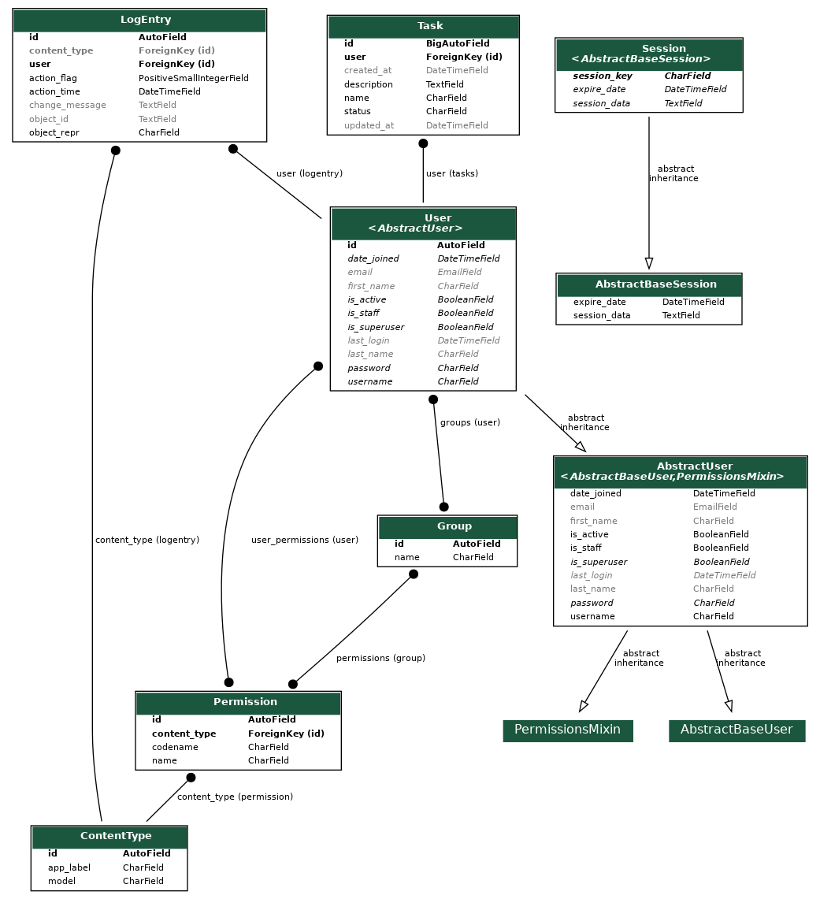

# Task Management

Project to manage tasks.

- Developed with the Django framework and Python `3.10`
- Register users
- The users can:
    - create, list, delete and update, change statys only own tasks
- The authentication system for APIs is JWT

## Run project
1. Create a virtual env and install packages
    ```bash
    virtualenv env # create virtualenv
    source env/bin/activate # activate virtualenv
    pip install -r requirements.txt # install packages
    ```
2. Apply migrations:
    ```bash
    python manage.py migrate
    ```
3. Run tests
    ```bash
    python manage.py test
    # or with coverage
    coverage run --source='.' manage.py test # run tests
    coverage report --omit='*migrations*' --skip-covered # report
    ```
4. Create super user:
    ```
    python manage.py createsuperuser
    ```
5. Run server:
    ```
    python manage.py runserver
    ```

**You can use `Make` to do some operations:**
```
make makemigrations # create migrations
make migrate # apply migrations
make create-superuser # create a super user
make shell-plus # launch the shell_plus
make runserver # run server
make coverage-run # launch coverage tests
coverage-report # get report coverage tests
```

If you create a super user you can access the admin:
`/admin`

## Documentation
- [Endpoints documenttion](docs/endpoints/endpoints_doc.md)
- The api swagger docs is available:
    `/api/schema/swagger-ui/`
- The api redocs is available:
    `/api/schema/redocs/`

## Diagrams



## Postman collections
You can use the Postman collection for test:

[](https://app.getpostman.com/run-collection/587528-b21b924e-83a1-44df-bd51-1fb272a02edf?action=collection%2Ffork&collection-url=entityId%3D587528-b21b924e-83a1-44df-bd51-1fb272a02edf%26entityType%3Dcollection%26workspaceId%3D87227067-2bba-4862-97e3-a425444e8ff4#?env%5BTask%20Management%5D=W3sia2V5IjoidXJsIiwidmFsdWUiOiJodHRwOi8vbG9jYWxob3N0OjgwMDAiLCJlbmFibGVkIjp0cnVlLCJ0eXBlIjoiZGVmYXVsdCIsInNlc3Npb25WYWx1ZSI6Imh0dHA6Ly9sb2NhbGhvc3Q6ODAwMCIsInNlc3Npb25JbmRleCI6MH0seyJrZXkiOiJ0b2tlbiIsInZhbHVlIjoiIiwiZW5hYmxlZCI6dHJ1ZSwidHlwZSI6ImRlZmF1bHQiLCJzZXNzaW9uVmFsdWUiOiIiLCJzZXNzaW9uSW5kZXgiOjF9LHsia2V5IjoicmVmcmVzaCIsInZhbHVlIjoiIiwiZW5hYmxlZCI6dHJ1ZSwidHlwZSI6ImRlZmF1bHQiLCJzZXNzaW9uVmFsdWUiOiIiLCJzZXNzaW9uSW5kZXgiOjJ9LHsia2V5IjoicmVmcmVzaF90b2tlbiIsInZhbHVlIjoiIiwiZW5hYmxlZCI6dHJ1ZSwidHlwZSI6ImFueSIsInNlc3Npb25WYWx1ZSI6IiIsInNlc3Npb25JbmRleCI6M31d)